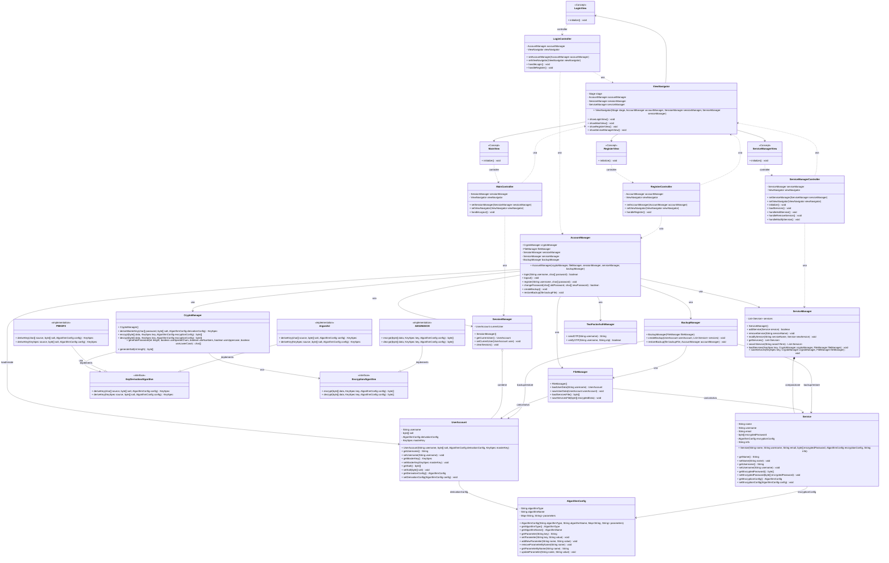

Modello completo. Serve per avere una visione completa. Non eliminare. Modificare aggiungendo eventuali classi o metodi.

```mermaid

classDiagram

    %% ===================
    %% CLASSI PRINCIPALI (Model)
    %% ===================

    class AccountManager {
        - CryptoManager cryptoManager
        - FileManager fileManager
        - SessionManager sessionManager
        - ServiceManager serviceManager
        - BackupManager backupManager

        + AccountManager(cryptoManager, fileManager, sessionManager, serviceManager, backupManager)
        + login(String username, char[] password) boolean
        + logout() void
        + register(String username, char[] password) void
        + changePassword(char[] oldPassword, char[] newPassword) boolean
        + createBackup() void
        + restoreBackup(file backupFile) void
    }

    class UserAccount {
        - String username
        - byte[] salt
        - AlgorithmConfig derivationConfig
        - KeySpec masterKey

        + UserAccount(String username, byte[] salt, AlgorithmConfig derivationConfig, KeySpec masterKey)
        + getUsername() String
        + setUsername(String username) void
        + getMasterKey() KeySpec
        + setMasterKey(KeySpec masterKey) void
        + getSalt() byte[]
        + setSalt(byte[] salt) void
        + getDerivationConfig() AlgorithmConfig
        + setDerivationConfig(AlgorithmConfig config) void
    }

    class ServiceManager {
        - List~Service~ services

        + ServiceManager()
        + addService(Service service) boolean
        + removeService(String serviceName) void
        + modifyService(String serviceName, Service newService) void
        + getServices() List~Service~
        + searchService(String searchTerm) List~Service~
        + loadServices(KeySpec key, CryptoManager cryptoManager, FileManager fileManager) void
        + saveServices(KeySpec key, CryptoManager cryptoManager, FileManager fileManager) void
    }

    class Service {
        - String name
        - String username
        - String email
        - byte[] encryptedPassword
        - AlgorithmConfig encryptionConfig
        - String info

        + Service(String name, String username, String email, byte[] encryptedPassword, AlgorithmConfig encryptionConfig, String info)
        + getName() String
        + setName(String name) void
        + getUsername() String
        + setUsername(String username) void
        + getEncryptedPassword() byte[]
        + setEncryptedPassword(byte[] encryptedPassword) void
        + getEncryptionConfig() AlgorithmConfig
        + setEncryptionConfig(AlgorithmConfig config) void
    }

    class SessionManager {
        - UserAccount currentUser

        + SessionManager()
        + getCurrentUser() UserAccount
        + setCurrentUser(UserAccount user) void
        + clearSession() void
    }

    class FileManager {
        + FileManager()
        + loadUserData(String username) UserAccount
        + saveUserData(UserAccount userAccount) void
        + loadServicesFile() byte[]
        + saveServicesFile(byte[] encryptedData) void
    }

    %% =====================
    %% GESTIONE ALGORITMI
    %% =====================

    class AlgorithmConfig {
        - String algorithmType
        - String algorithmName
        - Map~String, String~ parameters

        + AlgorithmConfig(String algorithmType, String algorithmName, Map~String, String~ parameters)
        + getAlgorithmType() AlgorithmType
        + getAlgorithmName() AlgorithmName
        + getParameter(String key) String
        + setParameter(String key, String value) void
        + addNewParameter(String name, String value) void
        + removeParameterByName(String name) void
        + getParameterByName(String name) String
        + updateParameter(String name, String value) void
    }

    class CryptoManager {
        + CryptoManager()
        + deriveMasterKey(char[] password, byte[] salt, AlgorithmConfig derivationConfig) KeySpec
        + encrypt(byte[] data, KeySpec key, AlgorithmConfig encryptionConfig) byte[]
        + decrypt(byte[] data, KeySpec key, AlgorithmConfig encryptionConfig) byte[]
        + generatePassword(int length, boolean useSpecialChars, boolean useNumbers, boolean useUppercase, boolean useLowerCase) char[]
        + generateSalt(int length) byte[]
    }

    %% Interfacce per gestire algoritmi diversi

    class KeyDerivationAlgorithm {
        <<interface>>
        + deriveKey(char[] source, byte[] salt, AlgorithmConfig config) KeySpec
        + deriveKey(KeySpec source, byte[] salt, AlgorithmConfig config) KeySpec
    }

    class EncryptionAlgorithm {
        <<interface>>
        + encrypt(byte[] data, KeySpec key, AlgorithmConfig config) byte[]
        + decrypt(byte[] data, KeySpec key, AlgorithmConfig config) byte[]
    }

    %% Implementazioni concrete degli algoritmi

    class PBKDF2 {
        <<implementation>>
        + deriveKey(char[] source, byte[] salt, AlgorithmConfig config) KeySpec
        + deriveKey(KeySpec source, byte[] salt, AlgorithmConfig config) KeySpec
    }

    class Argon2id {
        <<implementation>>
        + deriveKey(char[] source, byte[] salt, AlgorithmConfig config) KeySpec
        + deriveKey(KeySpec source, byte[] salt, AlgorithmConfig config) KeySpec
    }

    class AES256GCM {
        <<implementation>>
        + encrypt(byte[] data, KeySpec key, AlgorithmConfig config) byte[]
        + decrypt(byte[] data, KeySpec key, AlgorithmConfig config) byte[]
    }

    %% =====================
    %% BACKUP
    %% =====================

    class BackupManager {
        + BackupManager(FileManager fileManager)
        + createBackup(UserAccount userAccount, List~Service~ services) void
        + restoreBackup(file backupFile, AccountManager accountManager) void
    }

    %% =====================
    %% 2FA
    %% =====================
    class TwoFactorAuthManager {
        + sendOTP(String username) String
        + verifyOTP(String username, String otp) boolean
    }

    %% =====================
    %% ENUM
    %% =====================

    %% class AlgorithmType {
    %%     <<enum>>
    %%     DERIVATION
    %%     ENCRYPTION
    %% }

    %% class AlgorithmName {
    %%     <<enum>>
    %%     PBKDF2
    %%     Argon2id
    %%     AES256GCM
    %% }


    %% =====================
    %% COMPONENTI MVC
    %% =====================

    %% View (Rappresentate solo concettualmente, implementate nei file FXML)
    class LoginView {
        <<Concept>>
        + initialize() void
    }

    class MainView {
        <<Concept>>
        + initialize() void
    }

    class RegisterView {
        <<Concept>>
        + initialize() void
    }

    class ServiceManagerView {
        <<Concept>>
        + initialize() void
    }

    %% Controller (Classi Java concrete)
    class LoginController {
        - AccountManager accountManager
        - ViewNavigator viewNavigator
        + setAccountManager(AccountManager accountManager)
        + setViewNavigator(ViewNavigator viewNavigator)
        + handleLogin() void
        + handleRegister() void
    }

    class MainController {
        - SessionManager sessionManager
        - ViewNavigator viewNavigator
        + setSessionManager(SessionManager sessionManager)
        + setViewNavigator(ViewNavigator viewNavigator)
        + handleLogout() void
    }

    class RegisterController {
        - AccountManager accountManager
        - ViewNavigator viewNavigator
        + setAccountManager(AccountManager accountManager)
        + setViewNavigator(ViewNavigator viewNavigator)
        + handleRegister() void
    }

    class ServiceManagerController {
        - ServiceManager serviceManager
        - ViewNavigator viewNavigator
        + setServiceManager(ServiceManager serviceManager)
        + setViewNavigator(ViewNavigator viewNavigator)
        + initialize() void
        + loadServices() void
        + handleAddService() void
        + handleRemoveService() void
        + handleModifyService() void
    }

    class ViewNavigator {
        - Stage stage
        - AccountManager accountManager
        - SessionManager sessionManager
        - ServiceManager serviceManager
        + ViewNavigator(Stage stage, AccountManager accountManager, SessionManager sessionManager, ServiceManager serviceManager)
        + showLoginView() void
        + showMainView() void
        + showRegisterView() void
        + showServiceManagerView() void
    }

    %% =====================
    %% RELAZIONI TRA CLASSI
    %% =====================

    %% AccountManager usa i vari manager
    AccountManager --> CryptoManager : usa
    AccountManager --> FileManager : usa
    AccountManager --> SessionManager : usa
    AccountManager --> ServiceManager : usa
    AccountManager --> BackupManager : usa
    AccountManager --> TwoFactorAuthManager : usa

    %% AccountManager carica/crea l'UserAccount
    AccountManager --> UserAccount : load/create

    %% ServiceManager gestisce i Service
    ServiceManager *-- Service : composizione

    %% SessionManager mantiene un riferimento ad un solo UserAccount
    SessionManager o-- UserAccount : contiene

    %% FileManager carica/salva UserAccount e file dei servizi
    FileManager --> UserAccount : carica/salva
    FileManager --> Service : carica/salva

    %% UserAccount e Service possiedono la configurazione dell'algoritmo associata
    UserAccount --> AlgorithmConfig : derivationConfig
    Service --> AlgorithmConfig : encryptionConfig

    %% CryptoManager utilizza i parametri passati (config) e internamente crea un KeyDerivationAlgorithm o EncryptionAlgorithm
    CryptoManager --> KeyDerivationAlgorithm : usa
    CryptoManager --> EncryptionAlgorithm : usa

    %% Implementazioni concrete degli algoritmi
    PBKDF2 --|> KeyDerivationAlgorithm: implements
    Argon2id --|> KeyDerivationAlgorithm: implements
    AES256GCM --|> EncryptionAlgorithm: implements
    %% BackupManager
    BackupManager --> FileManager : usa
    BackupManager --> UserAccount : backup/restore
    BackupManager --> Service : backup/restore

    %% Componenti MVC
    LoginView ..> LoginController : controller
    MainView ..> MainController : controller
    RegisterView ..> RegisterController : controller
    ServiceManagerView ..> ServiceManagerController : controller

    LoginController ..> AccountManager : usa
    MainController ..> SessionManager : usa
    RegisterController ..> AccountManager : usa
    ServiceManagerController ..> ServiceManager : usa

    %% ViewNavigator
    ViewNavigator --> LoginView
    ViewNavigator --> MainView
    ViewNavigator --> RegisterView
    ViewNavigator --> ServiceManagerView
    MainController ..> ViewNavigator : usa
    LoginController ..> ViewNavigator : usa
    RegisterController ..> ViewNavigator : usa
    ServiceManagerController ..> ViewNavigator : usa

```