NON IMPLEMENTARE ALTRO. C'è DA RIGUARDARE UN ATTIMO LA PARTE DI PROGETTAZIONE.

Modello completo. Serve per avere una visione completa. Non eliminare. Modificare aggiungendo eventuali classi o metodi.

```mermaid

classDiagram

    %% ===================
    %% CLASSI PRINCIPALI (Model)
    %% ===================

    class AccountManager {
        - CryptoManager cryptoManager
        - FileManager fileManager
        - SessionManager sessionManager
        - ServiceManager serviceManager
        - BackupManager backupManager

        + AccountManager()
        + AccountManager(cryptoManager, fileManager, sessionManager, serviceManager, backupManager)

        + login(String username, char[] password) boolean
        + logout() boolean
        + register(String username, char[] password) boolean
        + changePassword(char[] oldPassword, char[] newPassword) boolean
        + createBackup() boolean
        + restoreBackup(file backupFile) boolean
    }

    class UserAccount {
        - String username
        - AlgorithmConfig derivationConfig
        - SecretKeySpec masterKey

        + UserAccount()
        + UserAccount(String username, byte[] salt, AlgorithmConfig derivationConfig, SecretKeySpec masterKey)
    }

    class ServiceManager {
        - PasswordGenerator passwordGenerator
        - List~Service~ services

        + ServiceManager()

        + selectService(String serviceName): Service
        + addService(Service service): boolean
        + removeService(String serviceName): boolean
        + modifyService(String serviceName, String serviceName, String newName, String newUsername, String newEmail, String newPassword, String newInfo): boolean
        + getServices(): List~Service~
        + searchService(String searchTerm): List~Service~
        + getDecryptedPassword(Service service): String
        + generatePassword(int length, boolean useSpecialChar, boolean useNumbers, boolean useUpperCase, boolean useLowerCase): char[]
        + loadServices(KeySpec key, CryptoManager cryptoManager, FileManager fileManager): boolean
        + saveServices(KeySpec key, CryptoManager cryptoManager, FileManager fileManager): boolean
    }

    class Service {
        - String name
        - String username
        - String email
        - byte[] encryptedPassword
        - AlgorithmConfig encryptionConfig
        - String info

        + Service(String name, String username, String email, byte[] encryptedPassword, AlgorithmConfig encryptionConfig,String info)
    }

    %% Builder per Service
    class ServiceBuilder {
        + build(): Service
    }

    class SessionManager {
        - UserAccount currentUser

        + SessionManager()
        + getCurrentUser() UserAccount
        + setCurrentUser(UserAccount user) void
        + clearSession() void
    }

    class FileManager {
        + FileManager()

        + loadUserData(String username) UserAccount
        + saveUserData(UserAccount userAccount) boolean
        + loadServicesFile() byte[]
        + saveServicesFile(byte[] encryptedData) boolean
    }

    %% =====================
    %% UTILS CLASS
    %% =====================
    class CryptoUtils {
        - CryptoUtils()
        + generateSalt(int length) byte[]$
        + cleanMemory(char[] source) void$
        + cleanMemory(byte[] source) void$
        + charToByteConverter(char[] source) byte[]$
        + charToByteConverter(char[] source, String charsetName) byte[]$
    }

    class PasswordGenerator {
        + generatePassword(int length, boolean useSpecialChar, boolean useNumbers, boolean useUpperCase, boolean useLowerCase) char[]$
    }

    %% =====================
    %% GESTIONE ALGORITMI
    %% =====================

    class AlgorithmConfig {
        - String algorithmType
        - String algorithmName
        - byte[] salt
        - Map~String, String~ parameters

        + AlgorithmConfig()
        + AlgorithmConfig(String algorithmType, String algorithmName)
        + AlgorithmConfig(String algorithmType, String algorithmName, byte[] salt, Map~String, String~ parameters)

        + addNewParameter(String name, String value) void
        + removeParameterByName(String name) void
        + getParameterValueByName(String name) String
        + updateParameter(String name, String value) void
    }

    class CryptoManager {
        + CryptoManager()

        + deriveMasterKey(char[] password, AlgorithmConfig derivationConfig) SecretKeySpec
        + encrypt(byte[] data, SecretKeySpec key, AlgorithmConfig encryptionConfig) byte[]
        + decrypt(byte[] data, SecretKeySpec key, AlgorithmConfig encryptionConfig) byte[]
    }

    %% Interfacce per gestire algoritmi diversi

    class KeyDerivationAlgorithm {
        <<interface>>
        + deriveKey(char[] source, byte[] salt, AlgorithmConfig config) SecretKeySpec
        + deriveKey(SecretKeySpec source, byte[] salt, AlgorithmConfig config) SecretKeySpec
    }

    class EncryptionAlgorithm {
        <<interface>>
        + encrypt(byte[] data, SecretKeySpec key, AlgorithmConfig config) byte[]
        + decrypt(byte[] data, SecretKeySpec key, AlgorithmConfig config) byte[]
    }

    %% Factory per gli algoritmi 

    class KeyDerivationAlgorithmFactory {
        <<Factory>>
        + createAlgorithm(String name) KeyDerivationAlgorithm
    }

    %% Implementazioni concrete degli algoritmi

    class PBKDF2 {
        <<implementation>>
        + deriveKey(char[] source, AlgorithmConfig config) SecretKeySpec
        + deriveKey(SecretKeySpec source, AlgorithmConfig config) SecretKeySpec
    }

    class Argon2id {
        <<implementation>>
        - getArgonVersion(AlgorithmConfig algorithmConfig) int
        + deriveKey(char[] source, AlgorithmConfig config) SecretKeySpec
        + deriveKey(SecretKeySpec source, AlgorithmConfig config) SecretKeySpec
    }

    class Scrypt {
        <<implementation>>
        + deriveKey(char[] source, AlgorithmConfig config) SecretKeySpec
        + deriveKey(SecretKeySpec source, AlgorithmConfig config) SecretKeySpec
    }

    class AES256GCM {
        <<implementation>>
        + encrypt(byte[] data, SecretKeySpec key, AlgorithmConfig config) byte[]
        + decrypt(byte[] data, SecretKeySpec key, AlgorithmConfig config) byte[]
    }

    %% =====================
    %% BACKUP
    %% =====================

    class BackupManager {
        + BackupManager(FileManager fileManager)
        + createBackup(UserAccount userAccount, List~Service~ services) void
        + restoreBackup(file backupFile, AccountManager accountManager) void
    }

    %% =====================
    %% 2FA
    %% =====================
    class TwoFactorAuthManager {
        + sendOTP(String username) String
        + verifyOTP(String username, String otp) boolean
    }

    %% =====================
    %% ENUM
    %% =====================

    %% class AlgorithmType {
    %%     <<enum>>
    %%     DERIVATION
    %%     ENCRYPTION
    %% }

    %% class AlgorithmName {
    %%     <<enum>>
    %%     PBKDF2
    %%     Argon2id
    %%     AES256GCM
    %% }


    %% =====================
    %% COMPONENTI MVC
    %% =====================

    %% View (Rappresentate solo concettualmente, implementate nei file FXML)
    class LoginView {
        <<Concept>>
        + initialize() void
    }

    class MainView {
        <<Concept>>
        + initialize() void
    }

    class RegisterView {
        <<Concept>>
        + initialize() void
    }

    class ServiceManagerView {
        <<Concept>>
        + initialize() void
    }

    %% Controller (Classi Java concrete)
    class LoginController {
        - AccountManager accountManager
        - ViewNavigator viewNavigator
        + setAccountManager(AccountManager accountManager)
        + setViewNavigator(ViewNavigator viewNavigator)
        + handleLogin() void
        + handleRegister() void
    }

    class MainController {
        - SessionManager sessionManager
        - ViewNavigator viewNavigator
        + setSessionManager(SessionManager sessionManager)
        + setViewNavigator(ViewNavigator viewNavigator)
        + handleLogout() void
    }

    class RegisterController {
        - AccountManager accountManager
        - ViewNavigator viewNavigator
        + setAccountManager(AccountManager accountManager)
        + setViewNavigator(ViewNavigator viewNavigator)
        + handleRegister() void
    }

    class ServiceManagerController {
        - ServiceManager serviceManager
        - ViewNavigator viewNavigator
        + setServiceManager(ServiceManager serviceManager)
        + setViewNavigator(ViewNavigator viewNavigator)
        + initialize() void
        + loadServices() void
        + handleAddService() void
        + handleRemoveService() void
        + handleModifyService() void
    }

    class ViewNavigator {
        - Stage stage
        - AccountManager accountManager
        - SessionManager sessionManager
        - ServiceManager serviceManager
        + ViewNavigator(Stage stage, AccountManager accountManager, SessionManager sessionManager, ServiceManager serviceManager)
        + showLoginView() void
        + showMainView() void
        + showRegisterView() void
        + showServiceManagerView() void
    }

    %% =====================
    %% RELAZIONI TRA CLASSI
    %% =====================

    %% AccountManager usa i vari manager
    AccountManager *-- CryptoManager : composition
    AccountManager *-- FileManager : composition
    AccountManager *-- ServiceManager : composition
    AccountManager *-- SessionManager : composition
    AccountManager *-- BackupManager : composition
    AccountManager --> TwoFactorAuthManager : usa

    %% ServiceManager gestisce i Service
    ServiceManager *-- Service : composizione
    ServiceManager --> PasswordGenerator : usa

    %% SessionManager mantiene un riferimento ad un solo UserAccount
    SessionManager o-- UserAccount : contiene

    %% FileManager carica/salva UserAccount e file dei servizi
    FileManager --> UserAccount : uses

    %% UserAccount
    UserAccount *-- AlgorithmConfig : composition

    %% Service
    Service --> AlgorithmConfig : encryptionConfig

    %% CryptoManager
    CryptoManager --> AlgorithmConfig : uses
    CryptoManager --> KeyDerivationAlgorithm : uses
    CryptoManager --> KeyDerivationAlgorithmFactory : uses
    CryptoManager --> CryptoUtils : calls

    %% CryptoUtils


    %% KeyDerivationAlgorithm
    KeyDerivationAlgorithm --> AlgorithmConfig : uses

    %% Implementazioni concrete degli algoritmi
    PBKDF2 ..|> KeyDerivationAlgorithm: implements
    Argon2id ..|> KeyDerivationAlgorithm: implements
    Scrypt ..|> KeyDerivationAlgorithm: implements
    AES256GCM ..|> EncryptionAlgorithm: implements

    %% BackupManager
    BackupManager --> FileManager : usa
    BackupManager --> UserAccount : backup/restore
    BackupManager --> Service : backup/restore

    %% Componenti MVC
    LoginView ..> LoginController : controller
    MainView ..> MainController : controller
    RegisterView ..> RegisterController : controller
    ServiceManagerView ..> ServiceManagerController : controller

    LoginController ..> AccountManager : usa
    MainController ..> SessionManager : usa
    RegisterController ..> AccountManager : usa
    ServiceManagerController ..> ServiceManager : usa

    %% ViewNavigator
    ViewNavigator --> LoginView
    ViewNavigator --> MainView
    ViewNavigator --> RegisterView
    ViewNavigator --> ServiceManagerView
    MainController ..> ViewNavigator : usa
    LoginController ..> ViewNavigator : usa
    RegisterController ..> ViewNavigator : usa
    ServiceManagerController ..> ViewNavigator : usa

```

