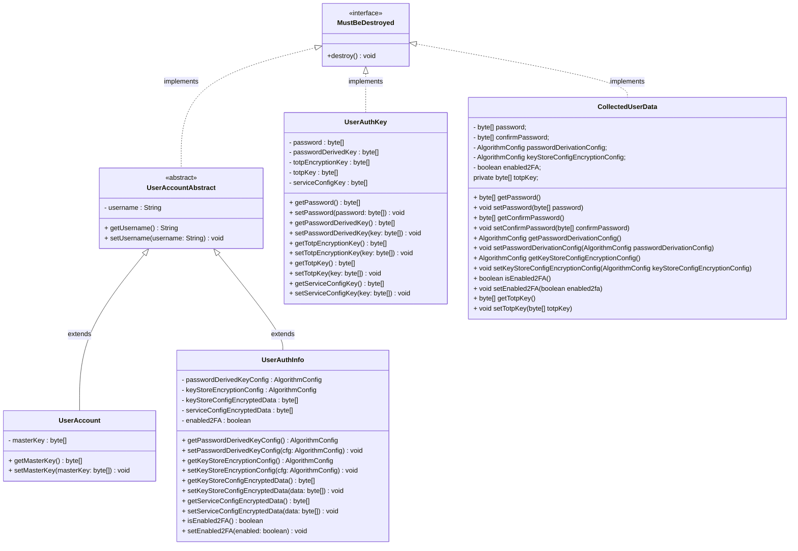

# User data

# Account manager
classDiagram
    %% Interfaces
    class AccountManager {
        <<interface>>
        +register(CollectedUserData data)
        +login(CollectedUserData data)
        +logout()
        +getSessionManager() SessionManager
        +getServiceManager() ServiceManager
    }

    class SessionManager {
        <<interface>>
        +getUserAuthInfo() UserAuthInfo
        +setUserAuthInfo(UserAuthInfo info)
        +getUserAuthKey() UserAuthKey
        +setUserAuthKey(UserAuthKey key)
        +getKeyStoreConfig() KeyStoreConfig
        +setKeyStoreConfig(KeyStoreConfig config)
        +getServiceConfig() ServiceCryptoConfig
        +setServiceConfig(ServiceCryptoConfig config)
        +getUserAccount() UserAccount
        +setUserAccount(UserAccount account)
    }

    class MustBeDestroyed {
        <<interface>>
        +destroy()
    }

    class RegistrationService {
        <<interface>>
        +register(CollectedUserData collectedUserData)
    }

    class LoginService {
        <<interface>>
        +login(CollectedUserData collectedUserData)
    }

    %% Concrete classes
    class DefaultAccountManager {
        -SessionManager sessionManager
        -ServiceManager serviceManager
        -RegistrationService registrationService
        -LoginService loginService

        +setSessionManager(SessionManager sessionManager)
        +setServiceManager(ServiceManager serviceManager)
    }

    class DefaultSessionManager {
        -UserAuthInfo userAuthInfo
        -UserAuthKey userAuthKey
        -KeyStoreConfig keyStoreConfig
        -ServiceCryptoConfig serviceConfig
        -UserAccount userAccount
    }

    class ServiceManager {
        
    }

    class KeyStoreConfig {
        -byte[] keyStoreEncryptionKey
        -byte[] saltWithPasswordDerived
        -byte[] saltWithTotpEncryptionKey
        -byte[] saltForHKDF
        -byte[] serviceDecryptionSalt

        +byte[] getKeyStoreEncryptionKey()
        +char[] getKeyStoreEncryptionKeyChar()
        +byte[] getSaltWithPasswordDerived()
        +char[] getSaltWithPasswordDerivedChar() 
        +byte[] getSaltWithTotpEncryptionKey()
        +char[] getSaltWithTotpEncryptionKeyChar()
        +byte[] getServiceDecryptionSalt()
        +void setKeyStoreEncryptionKey(byte[] keyStoreEncryptionKey)
        +void setSaltWithPasswordDerived(byte[] saltWithPasswordDerived)
        +void setSaltWithTotpEncryptionKey(byte[] saltWithTotpEncryptionKey)
        +void setServiceDecryptionSalt(byte[] serviceDecryptionSalt)
        +byte[] getSaltForHKDF()
        +void setSaltForHKDF(byte[] saltForHKDF)
    }

    class ServiceCryptoConfig {
        -char[] fileName
        -byte[] saltForHKDF
        -byte[] saltForServiceEncryption

        +char[] getFileName()
        +void setFileName(char[] fileName)
        +byte[] getSaltForHKDF()
        +void setSaltForHKDF(byte[] saltForHKDF)
        +byte[] getSaltForServiceEncryption()
        +void setSaltForServiceEncryption(byte[] serviceSalt)
    }

    class CollectedUserData {

    }

    %% Relationships
    AccountManager <|-- DefaultAccountManager : implements
    SessionManager <|-- DefaultSessionManager : implements
    MustBeDestroyed <|-- DefaultSessionManager : implements
    MustBeDestroyed <|-- KeyStoreConfig : implements
    MustBeDestroyed <|-- ServiceCryptoConfig : implements

    DefaultAccountManager --o SessionManager : uses
    DefaultAccountManager --o ServiceManager : uses
    DefaultAccountManager --o RegistrationService : uses
    DefaultAccountManager --o LoginService : uses
    DefaultSessionManager --o KeyStoreConfig : uses
    DefaultSessionManager --o ServiceCryptoConfig : uses

    CollectedUserData <.. AccountManager : uses
    CollectedUserData <.. RegistrationService: uses
    CollectedUserData <.. LoginService : uses 

# Login e registrazione
classDiagram
    class LoginService {
        <<interface>>
        +login(CollectedUserData collectedUserData)
    }

    class DefaultLoginService {
        -List~AuthenticationStep~ authenticationStep
        -KeyStoreManager keyStoreManager
        -ServiceCryptoConfigManager passwordListConfigManager
        -CryptoManager cryptoManager
        -SessionManager sessionManager
        +login(CollectedUserData collectedUserData)
        -loadUserPersonalData()
        -deriveKeyFromPassword()
        -loadKeyStore()
        -decryptServiceConfig()
        -deriveMasterKey()
        -loadUserPassword()
    }

    class RegistrationService {
        <<interface>>
        +register(CollectedUserData collectedUserData)
    }

    class DefaultRegistrationService {
        -List<AuthenticationStep> authenticationStep
        -KeyStoreManager keyStoreManager
        -ServiceCryptoConfigManager serviceCryptoConfigManager
        -CryptoManager cryptoManager
        -SessionManager sessionManager
        +register(CollectedUserData)
    }

    class AuthenticationStep {
        <<interface>>
        +executeStep()
    }

    class AuthenticationStepAbstract {
        <<abstract>>
        -SessionManager sessionManager
        +executeStep()*
        +getSessionManager()
        +setSessionManager(SessionManager sessionManager)
    }

    class AuthenticationCollectingStepAbstract {
        <<abstract>>
        -CollectedUserData collectedUserData
        +getCollectedUserData()
        +setCollectedUserData(CollectedUserData collectedUserData)
    }

    class InsertUserData {
        
    }

    class LoadUserData {
        
    }

    class DeriveKeyFromPassword {
        
    }

    class DecryptKeyStoreConfig {
        
    }

    class LoadKeyStore {
        
    }

    class GetKeyFromKeyStore {
        
    }

    class DeriveServiceConfigKey {
        
    }

    class DecryptServiceConfig {
        
    }

    class DeriveMasterKey {
        
    }

    class LoadUserPassword {
        
    }

    LoginService <|.. DefaultLoginService : implements
    AuthenticationStep <|.. AuthenticationStepAbstract : implements

    AuthenticationStepAbstract <|-- AuthenticationCollectingStepAbstract : extends
    AuthenticationCollectingStepAbstract <|-- InsertUserData : extends
    AuthenticationStepAbstract <|-- LoadUserData : extends
    AuthenticationStepAbstract <|-- DeriveKeyFromPassword : extends
    AuthenticationStepAbstract <|-- DecryptKeyStoreConfig : extends
    AuthenticationStepAbstract <|-- LoadKeyStore : extends
    AuthenticationStepAbstract <|-- GetKeyFromKeyStore : extends
    AuthenticationStepAbstract <|-- DeriveServiceConfigKey : extends
    AuthenticationStepAbstract <|-- DecryptServiceConfig : extends
    AuthenticationStepAbstract <|-- DeriveMasterKey : extends
    AuthenticationStepAbstract <|-- LoadUserPassword : extends

    DefaultLoginService --* AuthenticationStep : uses

# Key store
classDiagram
    class KeyStoreManager {
        <<interface>>
        +createNewKeyStore()
        +loadKeyStore()
        +createKeyStoreConfig()
        +createKeyStoreEntry()
        +populateNewKeyStore()
        +saveKeyStore()
        +closeKeyStore()
        +encryptConfig()
        +decryptConfig()
        +getKeyStoreKeys()
    }

    class DefaultKeyStoreManager {
        -FileManager fileManager
        -SessionManager sessionManager
        -KeyStore keyStore
        -KeyStoreConfigService keyStoreService
        -KeyStoreCreator keyStoreCreator
        -KeyStoreStorageService keyStoreStorage
        -KeyStoreEntryService keyStoreEntryManager
        +createNewKeyStore()
        +loadKeyStore()
        +createKeyStoreConfig()
        +createKeyStoreEntry()
        +populateNewKeyStore()
        +saveKeyStore()
        +closeKeyStore()
        +encryptConfig()
        +decryptConfig()
        +getKeyStoreKeys()
        +getKeyStore() KeyStore
    }

    class KeyStoreConfigService {
        <<interface>>
        +generateKeyStoreConfigKey(KeyStoreConfig)
        +generateKeyStoreConfigSalt(KeyStoreConfig)
        +generateKeyStoreEntry(UserAuthKey)
        +encryptConfig(byte[], byte[], AlgorithmConfig) byte[]
        +decryptConfig(byte[], byte[], AlgorithmConfig) KeyStoreConfig
    }

    class DefaultKeyStoreConfigService {
        -int keyLength
        -PasswordGenerator passwordGenerator
        -CryptoManager cryptoManager
        +generateKeyStoreConfigKey(KeyStoreConfig)
        +generateKeyStoreConfigSalt(KeyStoreConfig)
        +generateKeyStoreEntry(UserAuthKey)
        +encryptConfig(byte[], byte[], AlgorithmConfig) byte[]
        +decryptConfig(byte[], byte[], AlgorithmConfig) KeyStoreConfig
        -generateAndSetKey(int, Consumer<byte[]>)
        -generateTotpEncryptionKey(Consumer<byte[]>)
        -generateTotpKey(Consumer<byte[]>)
    }

    class KeyStoreCreator {
        <<interface>>
        +createKeyStore(char[]) KeyStore
    }

    class DefaultKeyStoreCreator {
        +createKeyStore(char[]) KeyStore
    }

    class KeyStoreEntryService {
        <<interface>>
        +retrieveKey(KeyStore, String, char[]) byte[]
        +insertKey(KeyStore, String, byte[], char[])
    }

    class DefaultKeyStoreEntryService {
        +retrieveKey(KeyStore, String, char[]) byte[]
        +insertKey(KeyStore, String, byte[], char[])
    }

    class KeyStoreStorageService {
        <<interface>>
        +loadKeyStore(byte[], char[]) KeyStore
        +saveKeyStore(Path, KeyStore, char[])
        +closeKeyStore(KeyStore)
    }

    class DefaultKeyStoreStorageService {
        +loadKeyStore(byte[], char[]) KeyStore
        +saveKeyStore(Path, KeyStore, char[])
        +closeKeyStore(KeyStore)
    }

    class KeyStoreConfig {
        -byte[] keyStoreEncryptionKey
        -byte[] saltWithPasswordDerived
        -byte[] saltWithTotpEncryptionKey
        -byte[] saltForHKDF
        -byte[] serviceDecryptionSalt
        +serialize() byte[]
        +destroy()
        +getters/setters()
    }

    %% Relations
    KeyStoreManager <|.. DefaultKeyStoreManager: implements
    KeyStoreConfigService <|.. DefaultKeyStoreConfigService: implements
    KeyStoreCreator <|.. DefaultKeyStoreCreator: implements
    KeyStoreEntryService <|.. DefaultKeyStoreEntryService: implements
    KeyStoreStorageService <|.. DefaultKeyStoreStorageService: implements

    DefaultKeyStoreManager --* KeyStoreConfigService : composition
    DefaultKeyStoreManager --* KeyStoreCreator : composition
    DefaultKeyStoreManager --* KeyStoreStorageService : composition
    DefaultKeyStoreManager --* KeyStoreEntryService : composition
    DefaultKeyStoreManager --* SessionManager : composition

    DefaultKeyStoreManager --o FileManager : uses

    DefaultKeyStoreConfigService .. KeyStoreConfig
    DefaultKeyStoreCreator .. KeyStoreConfig
    DefaultKeyStoreEntryService .. KeyStoreConfig
    DefaultKeyStoreStorageService .. KeyStoreConfig

# service config
classDiagram
    class ServiceCryptoConfigManager {
        +createServiceConfig()
        +encryptConfig()
        +decryptConfig()
    }
    
    class DefaultServiceCryptoConfigManager {
        -sessionManager : SessionManager
        -passwordListConfigService : ServiceCryptoConfigService
        +createServiceConfig()
        +encryptConfig()
        +decryptConfig()
    }
    
    class ServiceCryptoConfigService {
        +createPasswordListConfig() : ServiceCryptoConfig
        +encryptConfig(data: byte[], key: byte[], algorithmConfig: AlgorithmConfig) byte[]
        +decryptConfig(data: byte[], key: byte[], algorithmConfig: AlgorithmConfig) byte[]
    }
    
    class DefaultServiceCryptoConfigService {
        -cryptoManager : CryptoManager
        +createPasswordListConfig() : ServiceCryptoConfig
        +encryptConfig(data: byte[], key: byte[], algorithmConfig: AlgorithmConfig) byte[]
        +decryptConfig(data: byte[], key: byte[], algorithmConfig: AlgorithmConfig) byte[]
        -generateFileName(setterFunction: Consumer)
        -generateHkdfSalt(setterFunction: Consumer)
        -generateEncryptionSalt(setterFunction: Consumer)
    }
    
    class ServiceCryptoConfig {
        -fileName: char[]
        -saltForHKDF: byte[]
        -saltForServiceEncryption: byte[]
        +serialize() byte[]
        +destroy()
    }
    
    ServiceCryptoConfigManager <|.. DefaultServiceCryptoConfigManager : implements
    ServiceCryptoConfigService <|.. DefaultServiceCryptoConfigService : implements
    ServiceCryptoConfig ..|> MustBeDestroyed : implements

    DefaultServiceCryptoConfigManager --* ServiceCryptoConfigService : uses

    DefaultServiceCryptoConfigService --* CryptoManager : uses
    DefaultServiceCryptoConfigManager --o SessionManager : uses
    
    ServiceCryptoConfigService .. ServiceCryptoConfig : uses
    DefaultServiceCryptoConfigManager .. ServiceCryptoConfig : uses

# algorithm
classDiagram

class CryptoManager {
    +deriveMasterKey(password: byte[], algorithmConfig: AlgorithmConfig) byte[]
    +encrypt(data: byte[], key: SecretKeySpec, algorithmConfig: AlgorithmConfig) byte[]
    +decrypt(data: byte[], key: SecretKeySpec, algorithmConfig: AlgorithmConfig) byte[]
}

class KeyDerivationAlgorithm {
    <<Interface>>
    +deriveKey(source: byte[], config: AlgorithmConfig) byte[]
}

class KeyDerivationFactory {
    +createAlgorithm(name: String) KeyDerivationAlgorithm$
}

class Argon2
class bcrypt
class hkdf
class scrypt

class EncryptionAlgorithm {
    <<Interface>>
    +encrypt(source: byte[], key: SecretKeySpec, algorithmConfig: AlgorithmConfig) byte[]
    +decrypt(source: byte[], key: SecretKeySpec, algorithmConfig: AlgorithmConfig) byte[]
}

class EncryptionAlgorithmFactory {
    +createAlgorithm(name: String) EncryptionAlgorithm$
}

class AES

class MustBeDestroyed {
    <<Interface>>
}

class AlgorithmConfigBuilder {
    <<Interface>>
    +setAlgorithmName(algorithmName: String) AlgorithmConfigBuilder
    +setAlgorithmType(algorithmType: String) AlgorithmConfigBuilder
    +setSalt(salt: byte[]) AlgorithmConfigBuilder
    +setParameters(parameters: Map<String,String>) AlgorithmConfigBuilder
    +addParameter(key: String, value: String) AlgorithmConfigBuilder
    +build() AlgorithmConfig
}

class DefaultAlgorithmConfigBuilder {
    -algorithmName: String
    -algorithmType: String
    -salt: byte[]
    -parameters: Map<String,String>
}

class AlgorithmConfigFactory {
    +createAlgorithmConfig(algorithmName: String, salt: byte[], params: Map<String,String>) AlgorithmConfig$
    -mergeParams(userParams: Map<String, String>, defaultParams: Map<String, String>) Map<String, String>$
    -buildConfig(name: String, type: String, salt byte[], params: Map<String, String>) AlgorithmConfig$
}

class AlgorithmConfig {
    -algorithmName: String
    -algorithmType: String
    -salt: byte[]
    -parameters: Map<String,String>
    +addNewParameter(key: String, value: String) void
    +removeParameterByName(key String) void
    +updateParameter(key: String, value: String) void
    +getParameterValueByName(key: String) String
    +destroy() void
}

CryptoManager --> KeyDerivationFactory : uses
CryptoManager --> EncryptionAlgorithmFactory : uses
CryptoManager --> AlgorithmConfig : uses
AlgorithmConfigFactory --> AlgorithmConfigBuilder : uses

KeyDerivationFactory --> KeyDerivationAlgorithm : create
EncryptionAlgorithmFactory --> EncryptionAlgorithm : create

KeyDerivationAlgorithm <|.. Argon2 : implements
KeyDerivationAlgorithm <|.. bcrypt : implements
KeyDerivationAlgorithm <|.. hkdf : implements
KeyDerivationAlgorithm <|.. scrypt : implements
EncryptionAlgorithm <|.. AES : implements
AlgorithmConfigBuilder <|.. DefaultAlgorithmConfigBuilder : implements
AlgorithmConfig ..|> MustBeDestroyed : implements

DefaultAlgorithmConfigBuilder --> AlgorithmConfig : build

# File manager
classDiagram
    class FileManager {
        <<interface>>
        +loadData(fileName: String) byte[]
        +saveData(fileName: String, data: byte[])
        +deleteData(fileName: String)
        +createPath(fileName: String) Path
    }

    class AbstractFileManager {
        #PathsConstant mainFolder
        #ExtensionsConstant extension

        +createPath(fileName: String)* 
        #InputStream openInputStream(path: Path)* 
    }

    class DefaultFileManager {
        -String userDir
    }

    class GenericFileManager {
    }

    class ResourcesFileManager {
        +void saveData(fileName: String, data: byte[])
        +void deleteData(fileName: String)
    }

    FileManager <|.. AbstractFileManager : implements
    
    AbstractFileManager <|-- DefaultFileManager : extends
    AbstractFileManager <|-- GenericFileManager : extends
    AbstractFileManager <|-- ResourcesFileManager : extends

# Controller and navigator
classDiagram    

    class GenericNavigator~S, T~ {
        <<interface>>
        +navigateTo(pathToFile: String, sceneTitle: String) GenericController~S, T~ 
        +~U~ navigateTo(pathToFile: String, sceneTitle: String, optionalData: U) GenericController~S, T~ 
        +getView() S
    }

    class GenericNavigatorAbstract~S, T~  {
        <<abstract>>
        - S view
        - T data
        
        + getData() T
        # setView(Parent, String)*
    }

    class SceneNavigator {
    }

    class StepNavigator {
    }

    class GenericController~S, T~ {
        <<interface>>
        + setNavigator(navigator: GenericNavigator~S, T~)
        + setData(data: T)
        + initializeData()
        + initializeData(optionalData: U)
    }

    class ControllerAbstract {
        <<abstract>>
        - GenericNavigator~S, T~ navigator
        - T data
        
        + getNavigator() : GenericNavigator~S, T~
        + getData() : T
    }

    GenericNavigator <|.. GenericNavigatorAbstract : implements
    GenericController <|.. ControllerAbstract : implements

    GenericNavigatorAbstract <|-- SceneNavigator : extends
    GenericNavigatorAbstract <|-- StepNavigator : extends

    GenericNavigator ..> GenericController : return

    ControllerAbstract <|-- MainRegistrationController : extends
    ControllerAbstract <|-- LoginController : extends

