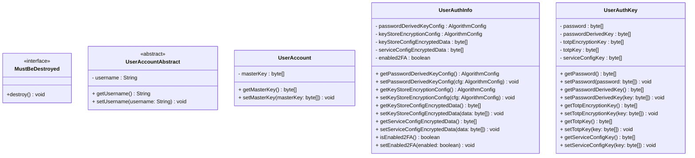

# User data

```mermaid

classDiagram

%% Interface
class MustBeDestroyed {
  <<interface>>
  +destroy() void
}

%% Abstract classes
class UserAccountAbstract {
  <<abstract>>
  - username : String
  + getUsername() String
  + setUsername(username: String) void
}

%% Concrete classes
class UserAccount {
  - masterKey : byte[]
  + getMasterKey() byte[]
  + setMasterKey(masterKey: byte[]) void
}

class UserAuthInfo {
  - passwordDerivedKeyConfig : AlgorithmConfig
  - keyStoreEncryptionConfig : AlgorithmConfig
  - keyStoreConfigEncryptedData : byte[]
  - serviceConfigEncryptedData : byte[]
  - enabled2FA : boolean
  + getPasswordDerivedKeyConfig() AlgorithmConfig
  + setPasswordDerivedKeyConfig(cfg: AlgorithmConfig) void
  + getKeyStoreEncryptionConfig() AlgorithmConfig
  + setKeyStoreEncryptionConfig(cfg: AlgorithmConfig) void
  + getKeyStoreConfigEncryptedData() byte[]
  + setKeyStoreConfigEncryptedData(data: byte[]) void
  + getServiceConfigEncryptedData() byte[]
  + setServiceConfigEncryptedData(data: byte[]) void
  + isEnabled2FA() boolean
  + setEnabled2FA(enabled: boolean) void
}

class UserAuthKey {
  - password : byte[]
  - passwordDerivedKey : byte[]
  - totpEncryptionKey : byte[]
  - totpKey : byte[]
  - serviceConfigKey : byte[]
  + getPassword() byte[]
  + setPassword(password: byte[]) void
  + getPasswordDerivedKey() byte[]
  + setPasswordDerivedKey(key: byte[]) void
  + getTotpEncryptionKey() byte[]
  + setTotpEncryptionKey(key: byte[]) void
  + getTotpKey() byte[]
  + setTotpKey(key: byte[]) void
  + getServiceConfigKey() byte[]
  + setServiceConfigKey(key: byte[]) void
}

```