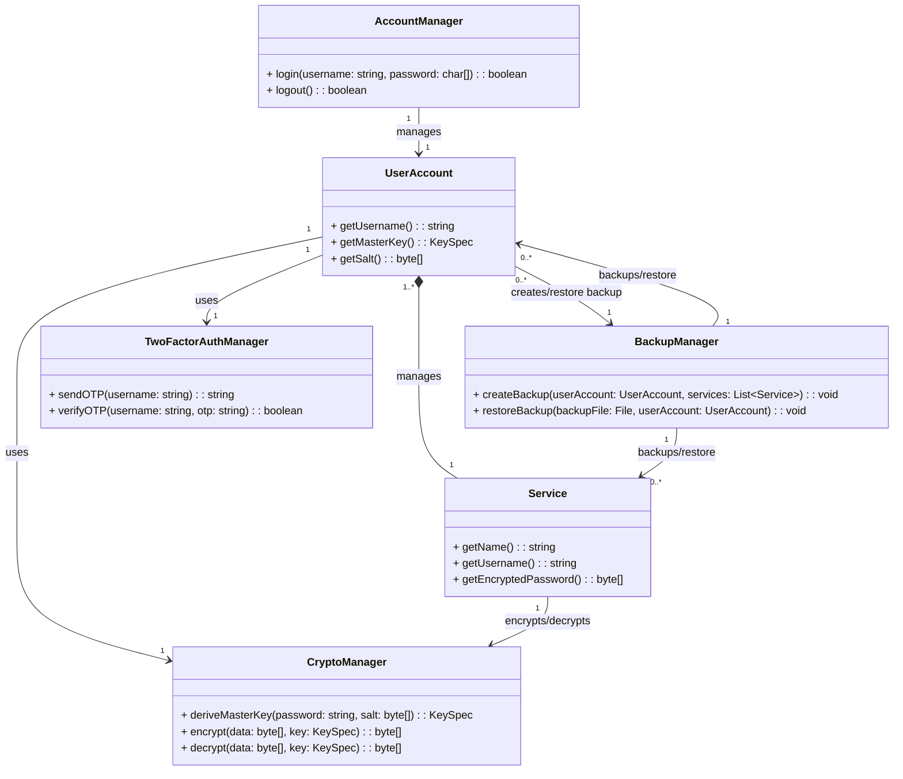

# Relazione di Progetto: Gestore di password

Questo progetto, sviluppato per il corso di PSS 2024/25, si propone di creare un'applicazione di gestione delle password.

## Analisi

L'applicazione mira a garantire una protezione avanzata dei credenziali degli utenti in un unico posto.

### Requisiti Funzionali

- [RF 1]: Registrazione degli utenti:
    1. Gli utenti devono poter creare un account definendo un nome utente e una password.

- [RF 2]: Autenticazione degli utenti:
    1. Sarà possibile accedere all'app tramite inserimento dei propri username e password.
    2. Il sistema dovrà poi essere in grado di verificare che la password inserita sia uguale a quella dell’utente corrispondente.

- [RF 3]: Gestione delle credenziali salvate:
    1. Gli utenti devono poter gestire i propri servizi, ossia archiviarli, visualizzarli, modificarli ed infine eliminarli.
    2. L'applicazione permetterà di aggiungere informazioni aggiuntive alle credenziali, come per esempio le note.

- [RF 4]: Sicurezza dei dati
    1. I dati sensibili, come username e password, non saranno mai memorizzati in chiaro.
    2. I dati saranno temporaneamente decriptati in memoria solo quando necessario.

- [RF 5]: Funzionalità di ricerca _(opzionale)_.
    1. Gli utenti finali avranno la possibilità di cercare un servizio specifico utilizzando una barra di ricerca.

- [RF 6]: Autenticazione a due fattori (2FA) _(opzionale)_.
    1. Ci sarà un’opzione per aggiungere un ulteriore livello di sicurezza, tramite autenticazione a due fattori.

- [RF 7]: Generazione di password sicure _(opzionale)_.
    1. Si potrà generare automaticamente password complesse e sicure, che rispettino parametri specifici, come la presenza di lettere maiuscole, numeri e caratteri speciali.

- [RF 8]: Backup e ripristino dei dati _(opzionale)_.
    1. Il gestore di password offrirà la possibilità di creare backup dei dati in formato criptato e di ripristinarli.

### Requisiti Non Funzionali

- [RNF 1]: L'applicazione deve garantire un alto livello di sicurezza durante tutte le operazioni.

- [RNF 2]: Il gestore dovrà essere efficiente nell'uso delle risorse.

- [RNF 3]: L’interfaccia grafica dovrà essere intuitiva e semplice da utilizzare.

- [RNF 4]: L’app dovrà essere in grado di funzionare completamente offline.

- [RNF 5]: Il progetto sarà open-source, consentendo miglioramenti futuri a tutti.


## Analisi e modello del Dominio

Il dominio dell'applicazione riguarda la gestione sicura di credenziali per l'accesso a diversi servizi online.
Gli elementi principali sono:
1. **Utente (UserAccount)**  
    E' un'entità caratterizzata da un identificativo univoco (come nome utente o email), una password (utilizzata per derivare una chiave segreta), e un insieme di servizi a cui accede.

2. **Servizio (Service)**  
    Ogni utente gestisce uno o più servizi, che hanno un nome e memorizzano username e password cifrata.

3. **Autenticazione (AccountManager)**  
    Parte responsabile dell'accesso al sistema che avvenire tramite inserimento di un username e una password.
    Può essere rafforzato con un sistema di autenticazione a due fattori (2FA).

4. **Crittografia (CryptoManager)**  
    I dati devono essere protetti attraverso meccanismi di crittografia.
    Ogni servizio memorizza credenziali cifrate utilizzando una chiave derivata dalla password principale dell'utente.

5. **Backup (BackupManager)**  
    Entità per la creazione e ripristino dei backup delle credenziali salvate.
    I dati devono essere cirfati per mantenere la sicurezza.

6. **Autenticazione a Due Fattori (TwoFactorAuthManager)**  
    Per aumentare la sicurezza, oltre alla password principale, potrebbe essere richiesto un codice OTP.

Gli elementi costitutivi sono sintetizzati nella seguente figura.



**Difficoltà Principali**  
_Gestione sicura delle credenziali:_ Garantire che la memorizzazione e il recupero delle credenziali avvengano in modo sicuro.  
_Derivazione sicura della chiave principale:_ È essenziale scegliere algoritmi di derivazione delle chiavi robusti per proteggere i dati.  
_Sicurezza nei backup:_ Deve essere garantito che i backup non compromettano la sicurezza delle credenziali.  
_Autenticazione a due fattori:_ L'integrazione con un sistema 2FA deve essere gestita in modo efficace senza compromettere l'usabilità.

# Design


## Architettura

```mermaid
classDiagram

```

## Design dettagliato

# Sviluppo

## Testing automatizzato

## Note di sviluppo

# Commenti finali

## Autovalutazione e lavori futuri

# Guida utente

