# Relazione di Progetto: Gestore di password

Questo progetto, sviluppato per il corso di PSS 2024/25, si propone di creare un'applicazione di gestione delle password.

## Analisi

L'applicazione mira a garantire una protezione avanzata dei dati sensibili degli utenti.

### Requisiti Funzionali

- [RF 1]: Registrazione degli utenti:
    1. Gli utenti devono poter creare un account fornendo uno username e una password.
    2. Il sistema dovrà guidare l'utente nella scelta di una password sicura, garantendo che rispetti parametri specifici, come la presenza di lettere maiuscole, numeri e caratteri speciali.

- [RF 2]: Autenticazione degli utenti:
    1. L'accesso al sistema sarà possibile tramite una combinazione di username e password.
    2. Il sistema dovrà verificare che la password inserita corrisponda a quella associata all’utente.

- [RF 3]: Gestione delle credenziali salvate:
    1. Gli utenti devono poter archiviare, visualizzare, modificare ed eliminare le credenziali associate ai vari servizi online.
    2. Il sistema permetterà di aggiungere informazioni aggiuntive alle credenziali, come email e note.

- [RF 4]: Sicurezza dei dati
    1. I dati sensibili, come username e password, non saranno mai memorizzati in chiaro.
    2. I dati saranno temporaneamente decriptati in memoria solo quando necessario.

- [RF 5]: Funzionalità di ricerca _(opzionale)_.
    1. Gli utenti devono poter cercare rapidamente le credenziali salvate per un servizio specifico utilizzando una barra di ricerca.

- [RF 6]: Autenticazione a due fattori (2FA) _(opzionale)_.
    1. Sarà offerta un’opzione per aggiungere un ulteriore livello di sicurezza, tramite autenticazione a due fattori.

- [RF 7]: Generazione di password sicure _(opzionale)_.
    1. Gli utenti potranno generare automaticamente password complesse e sicure.

- [RF 8]: Backup e ripristino dei dati _(opzionale)_.
    1. Il sistema offrirà la possibilità di creare backup dei dati in formato criptato e di ripristinarli in caso di necessità.

### Requisiti Non Funzionali

- [RNF 1]: _Sicurezza_. L'applicazione deve garantire un alto livello di sicurezza, proteggendo i dati sensibili degli utenti durante tutte le operazioni.

- [RNF 2]: _Efficienza_. L'applicazione dovrà essere ottimizzata per funzionare su dispositivi con risorse limitate.

- [RNF 3]: _Interfaccia user-friendly_. L’interfaccia grafica dovrà essere intuitiva e semplice da utilizzare, anche per utenti non esperti.

- [RNF 4]: _Operatività offline_. L’applicazione funzionerà completamente offline, eliminando il rischio di esposizione dei dati tramite connessioni esterne.

- [RNF 5]: _Open-source_. L'applicazione sarà open-source, consentendo agli utenti e agli sviluppatori di verificare il codice e personalizzarlo in base alle proprie esigenze.


## Analisi e modello del Dominio

Il dominio dell'applicazione riguarda la gestione sicura di credenziali per l'accesso a diversi servizi online.
Gli elementi principali sono:
1. **Utente**  
    Un utente rappresenta una persona che vuole gestire in modo sicuro le proprie credenziali per diversi servizi.
    Ogni utente ha un identificativo univoco (es. nome utente o email) e una chiave segreta drivata da una password principale.
2. **Servizio**  
    Un servizio è una risorsa digitale per la quale l'utente dispone di credenziali di accesso.
    Ogni servizio ha un nome e memorizza dati come username e password cifrata.

3. **Autenticazione**  
    Per accedere ai propri dati l'utente deve essere autenticato.
    L'autenticazione consiste in una combinazione di credenziali memorizzate e, opzionalmente, in un sistema di 2FA.

4. **Sicurezza**  
    I dati memorizzati devono essere protetti attraverso meccanismi di crittografia.
    Ogni servizio memorizza le credenziali cifrate con un meccanismo di derivazione da una chiave principale.

5. **Backup**  
    Gli utenti possono creare e ripristinare backup delle proprie credenziali in caso di perdita dei dati.
    Il backup deve essere cifrato per garantire la sicurezza.

6. **Autenticazione a Due Fattori**  
    Oltre alla password principale, potrebbe essere richiesta autenticazione tramite un codice OTP.

Gli elementi costitutivi sono sintetizzati nella seguente figura.

```mermaid

classDiagram

    %% ===================
    %% CLASSI PRINCIPALI (Model)
    %% ===================

    class AccountManager {
        + AccountManager(cryptoManager, fileManager, sessionManager, serviceManager, backupManager)
        + login(string username, char[] password) boolean
        + logout() void
        + register(string username, char[] password) void
        + changePassword(char[] oldPassword, char[] newPassword) boolean
        + createBackup() void
        + restoreBackup(file backupFile) void
    }

    class UserAccount {
        + getUsername() string
        + getMasterKey() KeySpec
        + getSalt() byte[]
        + getDerivationConfig() AlgorithmConfig
    }

    class ServiceManager {
        + addService(Service service) boolean
        + removeService(string serviceName) void
        + modifyService(string serviceName, Service newService) void
        + getServices() List~Service~
        + searchService(string searchTerm) List~Service~
        + loadServices(KeySpec key, CryptoManager cryptoManager, FileManager fileManager) void
        + saveServices(KeySpec key, CryptoManager cryptoManager, FileManager fileManager) void
    }

    class Service {
        + getName() string
        + getUsername() string
        + getEncryptedPassword() byte[]
        + getEncryptionConfig() AlgorithmConfig
    }

    class SessionManager {
        + getCurrentUser() UserAccount
        + setCurrentUser(UserAccount user) void
        + clearSession() void
    }

    class FileManager {
        + loadUserData(string username) UserAccount
        + saveUserData(UserAccount userAccount) void
        + loadServicesFile() byte[]
        + saveServicesFile(byte[] encryptedData) void
    }

    %% =====================
    %% GESTIONE ALGORITMI
    %% =====================

    class AlgorithmConfig {
        + getAlgorithmType() AlgorithmType
        + getAlgorithmName() AlgorithmName
        + getParameter(string key) string
        + setParameter(string key, string value) void
    }

    class CryptoManager {
        + deriveMasterKey(char[] password, byte[] salt, AlgorithmConfig derivationConfig) KeySpec
        + encrypt(byte[] data, KeySpec key, AlgorithmConfig encryptionConfig) byte[]
        + decrypt(byte[] data, KeySpec key, AlgorithmConfig encryptionConfig) byte[]
        + generatePassword(int length, boolean useSpecialChars, boolean useNumbers, boolean useUppercase, boolean useLowerCase) char[]
        + generateSalt(int length) byte[]
    }

    %% Interfacce per gestire algoritmi diversi

    class KeyDerivationAlgorithm {
        <<interface>>
        + deriveKey(char[] source, byte[] salt, AlgorithmConfig config) KeySpec
        + deriveKey(KeySpec source, byte[] salt, AlgorithmConfig config) KeySpec
    }

    class EncryptionAlgorithm {
        <<interface>>
        + encrypt(byte[] data, KeySpec key, AlgorithmConfig config) byte[]
        + decrypt(byte[] data, KeySpec key, AlgorithmConfig config) byte[]
    }

    %% Implementazioni concrete degli algoritmi

    class PBKDF2 {
        <<implementation>>
        + deriveKey(char[] source, byte[] salt, AlgorithmConfig config) KeySpec
        + deriveKey(KeySpec source, byte[] salt, AlgorithmConfig config) KeySpec
    }

    class Argon2id {
        <<implementation>>
        + deriveKey(char[] source, byte[] salt, AlgorithmConfig config) KeySpec
        + deriveKey(KeySpec source, byte[] salt, AlgorithmConfig config) KeySpec
    }

    class AES256GCM {
        <<implementation>>
        + encrypt(byte[] data, KeySpec key, AlgorithmConfig config) byte[]
        + decrypt(byte[] data, KeySpec key, AlgorithmConfig config) byte[]
    }

    %% =====================
    %% BACKUP
    %% =====================

    class BackupManager {
        + BackupManager(FileManager fileManager)
        + createBackup(UserAccount userAccount, List~Service~ services) void
        + restoreBackup(file backupFile, AccountManager accountManager) void
    }

    %% =====================
    %% 2FA
    %% =====================
    class TwoFactorAuthManager {
        + sendOTP(string username) string
        + verifyOTP(string username, string otp) boolean
    }

    %% =====================
    %% ENUM
    %% =====================

    %% class AlgorithmType {
    %%     <<enum>>
    %%     DERIVATION
    %%     ENCRYPTION
    %% }

    %% class AlgorithmName {
    %%     <<enum>>
    %%     PBKDF2
    %%     Argon2id
    %%     AES256GCM
    %% }

    %% =====================
    %% COMPONENTI MVC
    %% =====================

    %% View (Rappresentate solo concettualmente, implementate nei file FXML)
    class LoginView {
        <<Concept>>
        + initialize() void
    }

    class MainView {
        <<Concept>>
        + initialize() void
    }

    class RegisterView {
        <<Concept>>
        + initialize() void
    }

    class ServiceManagerView {
        <<Concept>>
        + initialize() void
    }

    %% Controller (Classi Java concrete)
    class LoginController {
        + setAccountManager(AccountManager accountManager)
        + setViewNavigator(ViewNavigator viewNavigator)
        + handleLogin() void
        + handleRegister() void
    }

    class MainController {
        + setSessionManager(SessionManager sessionManager)
        + setViewNavigator(ViewNavigator viewNavigator)
        + handleLogout() void
    }

    class RegisterController {
        + setAccountManager(AccountManager accountManager)
        + setViewNavigator(ViewNavigator viewNavigator)
        + handleRegister() void
    }

    class ServiceManagerController {
        + setServiceManager(ServiceManager serviceManager)
        + setViewNavigator(ViewNavigator viewNavigator)
        + initialize() void
        + loadServices() void
        + handleAddService() void
        + handleRemoveService() void
        + handleModifyService() void
    }

    class ViewNavigator {
        + showLoginView() void
        + showMainView() void
        + showRegisterView() void
        + showServiceManagerView() void
    }

    %% =====================
    %% RELAZIONI TRA CLASSI
    %% =====================

    %% AccountManager usa i vari manager
    AccountManager --> CryptoManager : usa
    AccountManager --> FileManager : usa
    AccountManager --> SessionManager : usa
    AccountManager --> ServiceManager : usa
    AccountManager --> BackupManager : usa
    AccountManager --> TwoFactorAuthManager : usa

    %% AccountManager carica/crea l'UserAccount
    AccountManager --> UserAccount : load/create

    %% ServiceManager gestisce i Service
    ServiceManager *-- Service : composizione

    %% SessionManager mantiene un riferimento ad un solo UserAccount
    SessionManager o-- UserAccount : contiene

    %% FileManager carica/salva UserAccount e file dei servizi
    FileManager --> UserAccount : carica/salva
    FileManager --> Service : carica/salva

    %% UserAccount e Service possiedono la configurazione dell'algoritmo associata
    UserAccount --> AlgorithmConfig : derivationConfig
    Service --> AlgorithmConfig : encryptionConfig

    %% CryptoManager utilizza i parametri passati (config) e internamente crea un KeyDerivationAlgorithm o EncryptionAlgorithm
    CryptoManager --> KeyDerivationAlgorithm : usa
    CryptoManager --> EncryptionAlgorithm : usa

    %% Implementazioni concrete degli algoritmi
    PBKDF2 --|> KeyDerivationAlgorithm: implements
    Argon2id --|> KeyDerivationAlgorithm: implements
    AES256GCM --|> EncryptionAlgorithm: implements
    %% BackupManager
    BackupManager --> FileManager : usa
    BackupManager --> UserAccount : backup/restore
    BackupManager --> Service : backup/restore

    %% Componenti MVC
    LoginView ..> LoginController : controller
    MainView ..> MainController : controller
    RegisterView ..> RegisterController : controller
    ServiceManagerView ..> ServiceManagerController : controller

    LoginController ..> AccountManager : usa
    MainController ..> SessionManager : usa
    RegisterController ..> AccountManager : usa
    ServiceManagerController ..> ServiceManager : usa

    %% ViewNavigator
    ViewNavigator --> LoginView
    ViewNavigator --> MainView
    ViewNavigator --> RegisterView
    ViewNavigator --> ServiceManagerView
    MainController ..> ViewNavigator : usa
    LoginController ..> ViewNavigator : usa
    RegisterController ..> ViewNavigator : usa
    ServiceManagerController ..> ViewNavigator : usa

```



# Design


## Architettura

```mermaid
classDiagram

```

## Design dettagliato

# Sviluppo

## Testing automatizzato

## Note di sviluppo

# Commenti finali

## Autovalutazione e lavori futuri

# Guida utente

