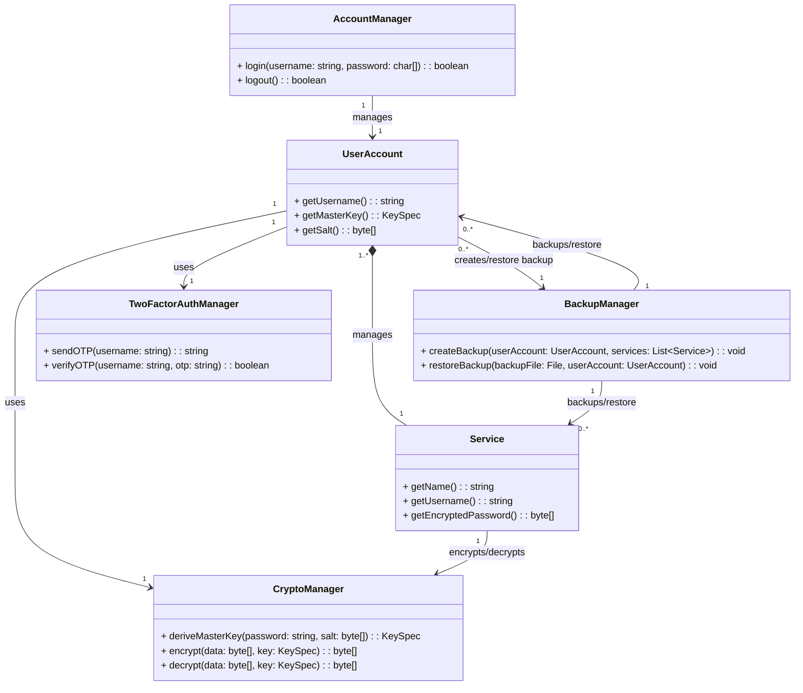
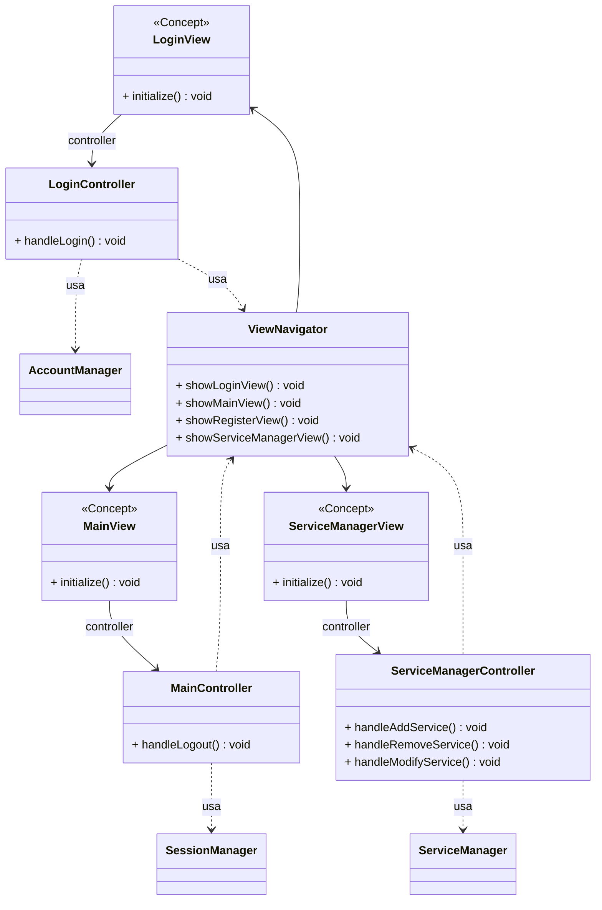
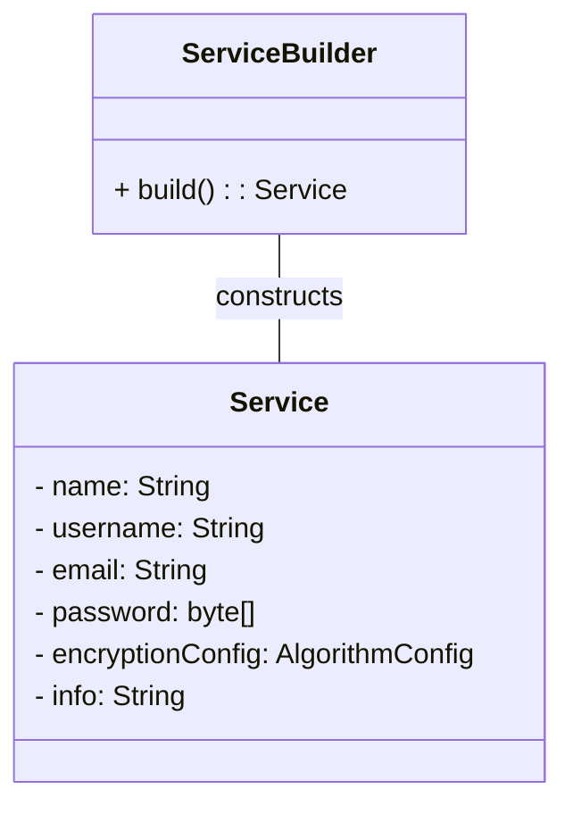
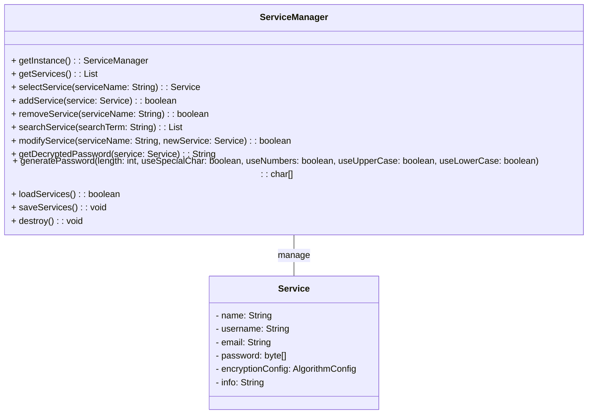
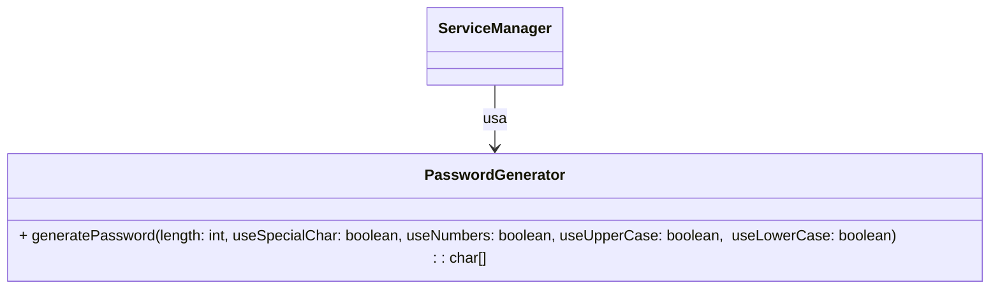
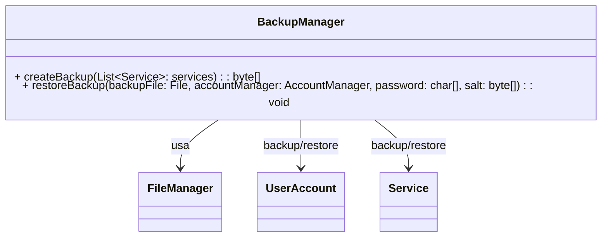
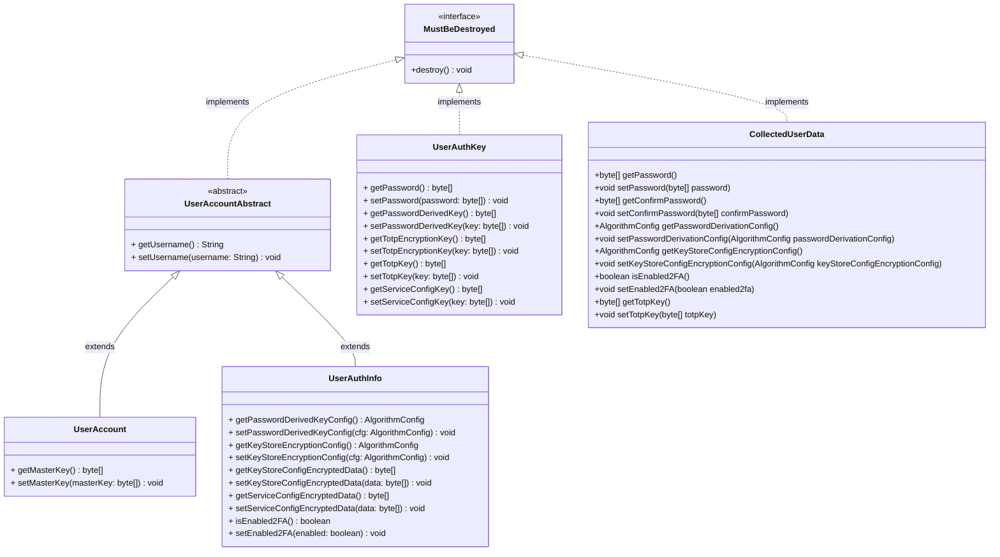
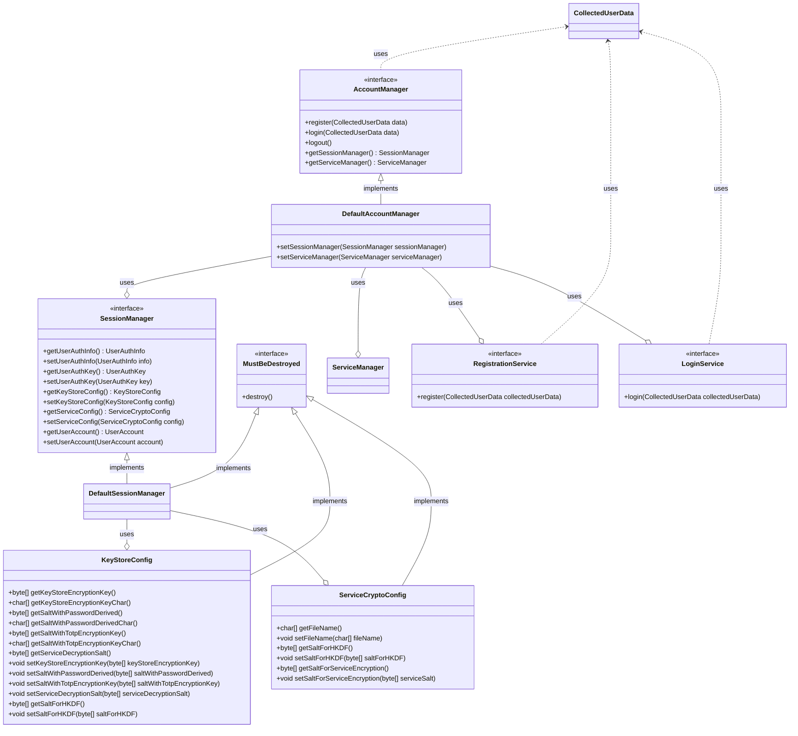

# Relazione di Progetto: Gestore di password

Questo progetto, sviluppato per il corso di PSS 2024/25, si propone di creare un'applicazione di gestione delle password.

## Analisi

L'applicazione mira a garantire una protezione avanzata dei credenziali degli utenti in un unico posto.

### Requisiti Funzionali

- [RF 1]: Registrazione degli utenti:
    1. Gli utenti devono poter creare un account definendo un nome utente e una password.

- [RF 2]: Autenticazione degli utenti:
    1. Sarà possibile accedere all'app tramite inserimento dei propri username e password.
    2. Il sistema dovrà poi essere in grado di verificare che la password inserita sia uguale a quella dell’utente corrispondente.

- [RF 3]: Gestione delle credenziali salvate:
    1. Gli utenti devono poter gestire i propri servizi, ossia archiviarli, visualizzarli, modificarli ed infine eliminarli.
    2. L'applicazione permetterà di aggiungere informazioni aggiuntive alle credenziali, come per esempio le note.

- [RF 4]: Sicurezza dei dati
    1. I dati sensibili, come username e password, non saranno mai memorizzati in chiaro.
    2. I dati saranno temporaneamente decriptati in memoria solo quando necessario.

- [RF 5]: Funzionalità di ricerca _(opzionale)_.
    1. Gli utenti finali avranno la possibilità di cercare un servizio specifico utilizzando una barra di ricerca.

- [RF 6]: Autenticazione a due fattori (2FA) _(opzionale)_.
    1. Ci sarà un’opzione per aggiungere un ulteriore livello di sicurezza, tramite autenticazione a due fattori.

- [RF 7]: Generazione di password sicure _(opzionale)_.
    1. Si potrà generare automaticamente password complesse e sicure, che rispettino parametri specifici, come la presenza di lettere maiuscole, numeri e caratteri speciali.

- [RF 8]: Backup e ripristino dei dati _(opzionale)_.
    1. Il gestore di password offrirà la possibilità di creare backup dei dati in formato criptato e di ripristinarli.

### Requisiti Non Funzionali

- [RNF 1]: L'applicazione deve garantire un alto livello di sicurezza durante tutte le operazioni.

- [RNF 2]: Il gestore dovrà essere efficiente nell'uso delle risorse.

- [RNF 3]: L’interfaccia grafica dovrà essere intuitiva e semplice da utilizzare.

- [RNF 4]: L’app dovrà essere in grado di funzionare completamente offline.

- [RNF 5]: Il progetto sarà open-source, consentendo miglioramenti futuri a tutti.


## Analisi e modello del Dominio

Il dominio dell'applicazione riguarda la gestione sicura di credenziali per l'accesso a diversi servizi online.
Gli elementi principali sono:
1. **Utente (UserAccount)**  
    E' un'entità caratterizzata da un identificativo univoco (come nome utente o email), una password (utilizzata per derivare una chiave segreta), e un insieme di servizi a cui accede.

2. **Servizio (Service)**  
    Ogni utente gestisce uno o più servizi, che hanno un nome e memorizzano username e password cifrata.

3. **Autenticazione (AccountManager)**  
    Parte responsabile dell'accesso al sistema che avvenire tramite inserimento di un username e una password.
    Può essere rafforzato con un sistema di autenticazione a due fattori (2FA).

4. **Crittografia (CryptoManager)**  
    I dati devono essere protetti attraverso meccanismi di crittografia.
    Ogni servizio memorizza credenziali cifrate utilizzando una chiave derivata dalla password principale dell'utente.

5. **Backup (BackupManager)**  
    Entità per la creazione e ripristino dei backup delle credenziali salvate.
    I dati devono essere cirfati per mantenere la sicurezza.

6. **Autenticazione a Due Fattori (TwoFactorAuthManager)**  
    Per aumentare la sicurezza, oltre alla password principale, potrebbe essere richiesto un codice OTP.

Gli elementi costitutivi sono sintetizzati nella seguente figura.



**Difficoltà Principali**  
_Gestione sicura delle credenziali:_ Garantire che la memorizzazione e il recupero delle credenziali avvengano in modo sicuro.  
_Derivazione sicura della chiave principale:_ È essenziale scegliere algoritmi di derivazione delle chiavi robusti per proteggere i dati.  
_Sicurezza nei backup:_ Deve essere garantito che i backup non compromettano la sicurezza delle credenziali.  
_Autenticazione a due fattori:_ L'integrazione con un sistema 2FA deve essere gestita in modo efficace senza compromettere l'usabilità.

# Design

## Architettura
Il sistema è fatto da 3 componenti principali, che seguono il pattern architetturale Model-View-Controller (MVC):
- **Model:** Comprende le classi principali che rappresentano il dominio dell'applicazione (gestione servizi, crittografia, backup, ecc.). Sono responsabili della gestione delle informazioni memorizzate e della logica del gestore. Il componente primario è `ServiceManager`, che si occupa della gestione di tutti i servizi.
- **View:** Si occupa dell'interfaccia grafica e dell'interazione con l'utente. Le principali classi sono `LoginView`, `MainView` e `ServiceManagerView`, che rappresentano schermate diverse dell’applicazione. Ogni vista comunica con il rispettivo controller per gestire le operazioni richieste.
- **Controller:** Funge da intermediario tra Model e View, leggendo le azioni dell'utente e aggiornando lo stato dell'app. `LoginController`, `MainController` e `ServiceManagerController` gestiscono la logica di interazione delle rispettive viste, facendo uso dei manager del Model.

In particolare, quando si fa un login `LoginView` invoca `LoginController`, che utilizza `AccountManager` per verificare le credenziali. Se tutto va bene, `ViewNavigator` cambia la vista su `MainView`. `MainView` comunica con `MainController`, che utilizza `SessionManager` per mantenere lo stato dell’utente connesso. `ServiceManagerView` mostra i servizi disponibili e passa le richieste a `ServiceManagerController`, che esegue operazioni richieste su `ServiceManager`.



## Design dettagliato

#### Parte di Nataliia Skybun.

**1. Creazione dei Servizi**  

**Problema**  
Gestore di password deve gestire vari tipi di servizi con un numero di campi. Inoltre, la password deve essere criptata prima di essere memorizzata, per evitare che vengano archiviati dati sensibili in chiaro.  
**Soluzione**  
Si è pensato di utilizzare il design pattern Builder in modo da semplificare la creazione dei nuovi servizi (evitando costruttori lunghi), assicurarsi che la password sia sempre criptata prima della memorizzazione e permette di avere una validazione dei campi centralizzata (ad esempio, evitando nomi vuoti o password nulle).  
_Pro:_ chiarezza nella creazione dei servizi; robustezza degli oggetti creati; sicurezza della password. _Contro:_ complessità aggiunta al sistema; possibile sovraccarico di memoria, per le classi intermedi.  
**Pattern**  
_Service:_ rappresenta il servizio con i dati sensibili. _ServiceBuilder:_ consente la costruzione di un Service in modo controllato. Durante la creazione cifra la password usando CryptoManager.

**2. Gestione dei servizi**  

**Problema**  
L'applicazione richiede un manager che gestisca un elenco di servizi legati all'utente, con funzionalità per l'aggiunta, la modifica, la rimozione e la ricerca di servizi. Inoltre, i dati dei servizi devono essere protetti tramite crittografia e memorizzati in un file sicuro. Utilizza anche il gestore di password per creare password sicure in caso di necessità.  
**Soluzione**  
Si è deciso di implementare la classe come un singleton per evitare istanze multiple e garantire un'unica gestione dei servizi in tutta l'app.  
_Pro:_ sicurezza; gestione centralizzata. _Contro:_ difficile da testare; evoluzione limitata.  
**Pattern**  
_ServiceManager_ con il metodo getInstance() assicura che esista solo una singola istanza della classe durante l'esecuzione dell'app.

**3. Generatore di password sicure**  

**Problema**  
Era necessario uno strumento che generi password complesse, sicure e conformi a specifici parametri (lunghezza, presenza di caratteri speciali, numeri e lettere maiuscole / minuscole) per evitare password banali ed evitare una vulnerabilità.  
**Soluzione**  
Si è progettato un modulo dedicato alla generazione delle password che accetta in input un numero che indica la lunghezza della password desiderata (con un minimo di 12 caratteri) e i valori booleani che indicano se utilizzare o meno un tipo di carattere.

**4. Sistema di backup e ripristino**

**Problema**  
Il sistema deve essere in grado di creare e ripristinare backup criptati di dati sensibili associati ai servizi e alle informazioni utente.  
**Soluzione**  
Creazione di una classe _BackupManager_ che gestisce centralmente la creazione e il ripristino dei dati. Viene generato una password lunga e complessa assieme a un salt per la crittografia. L'utente deve memorizzare questi dati in modo da effettuare il ripristino quando necessario. In questo modo si riesce a garantire una maggior robustezza al sistema, dato che contiene i dati altamente sensibili.  


#### Parte di Yuhang Zhu.  
**1. Account utente e authentication data**


**Problema**  
Il sistema gestisce in modo sicuro i dati di autentication e i dati di sessione dell'utente correntemente loggato.

**Soluzione**  
Tutti i dati utenti implementano direttamente oppure indirettamente tramite ereditarietà, un interfaccia comune che richiede l'implementazione di un metodo che permetta di eliminare i dati di sessione e i dati di autenticazione.
La presenza di almeno 2 classi che richiedano dei dati comuni, ha portato all'utilizzo di una classe astratta che ponga le basi per tutte le classi che richiedano una porzione di proprietà comuni.
La classe **UserAuthKey** contiene temporaneamente le chiavi intermedie dalle quali verranno generate la master key che verrà usata per cifrare e decifrare le password utenti.
La classe **UserAccount** conttiene le 2 informazioni di base essenziali: username e master key.
La clase **UserAuthInfo** contiene le informazioni riguardanti il singolo utente e che permettono di ottenere la master key e la lista delle chiavi dell'utente.
Queste classi vengono usati come DTO per trasferire dati da una classe all'altra.

**2. Account manager**


**Problema**
Il sistema di autenticazione deve gestire le fasi autenticazione dell'utente che comprendono login, registration e logout con relativa eliminazione dei dati sessione.

**Soluzione**
La soluzione adottata è la suddivisione delle classi in classi con responsabilità comuni e correlate, con ognuna delle quali che cerca di implementare i principi SOLID. Per rendere le classi più indipendenti, le classi dialogano tra di loro utilizzando delle interfacce.
L'interfaccia **AccountManager** richiede di implementare 3 metodi collegati all'autenticazione e alla gestione dell'utente: login, logout e registration utilizzando i dati collezionati dalla view. 
Esso viene implementato dalla classe concreta **DefaultAccountManager** che utilizza tramite aggregazione 4 classi sotto forma di interfacce: registrationService per gestire la fase di registrazione, loginService per gestire la fase di login, ServiceManager per gestire le password del singolo utente e SessionManager per gestire i dati personali di crittografia dell'account corrente.
La classe **DefaultSessionManager** implementa l'interfaccia **SessionManager** e viene usata per gestire tutti i dati di sicurezza dell'utente come la sua password oppure la master key usata per decifrare le password utente oppure le password intermedie che vengono usate per derivare la master key finale. Utilizza inoltre 2 classi con funzionalità di DTO perchè vengono usati solo contenere dati da trasferire tra classi.


# Sviluppo

## Testing automatizzato  
Per garantire la correttezza delle funzionalità principali dell'applicazione sono stati implementati test automatici utilizzando **JUnit** e in alcuni casi **Mockito**.  
Il testing si è concentrato sui componenti core della logica applicativa, in particolare:  
- _Classe [Service]:_ verifica del corretto funzionamento dei metodi per la creazione dei vari servizi.  
- _Classe [ServiceManager]:_ test per controllare certi metodi dedicati alla gestione dei servizi.  
- _Gestione degli errori:_ test per garantire che eccezioni e condizioni di errore vengano gestite correttamente.  

L’_interfaccia grafica_ non è stata testata per la complessità aggiuntiva e mancanza di tempo.  
Per l'implementazione dei test si è utilizzato **JUnit 5**, sfruttando le annotazioni @Test per definire i casi di test e @BeforeEach per la preparazione del contesto di esecuzione. Inoltre, **Mockito 5.12.0** usato per creare mock e simulare il comportamento di dipendenze esterne, evitando effetti collaterali nei test.

## Note di sviluppo

#### Parte di Nataliia Skybun.
#### 1. Utilizzo di libreria Passay
**Dove:** `com.zysn.passwordmanager.model.utils.security.impl.PasswordGenerator`  
**Snippet:**
```java
public char[] generatePassword(int length, boolean useSpecialChar, boolean useNumbers, boolean useUpperCase, boolean useLowerCase) {


        if (length < 12) {
            throw new IllegalArgumentException("Password length must be greater than 11.");
        }


        List<CharacterRule> rules = new ArrayList<>();
        if (useUpperCase) rules.add(new CharacterRule(EnglishCharacterData.UpperCase, 1));
        if (useLowerCase) rules.add(new CharacterRule(EnglishCharacterData.LowerCase, 1));
        if (useNumbers) rules.add(new CharacterRule(EnglishCharacterData.Digit, 1));
        if (useSpecialChar) rules.add(new CharacterRule(EnglishCharacterData.Special, 1));


        if (rules.size() < 2) {
            throw new IllegalArgumentException("You must select at least two character categories.");
        }
       
        org.passay.PasswordGenerator passayGenerator = new org.passay.PasswordGenerator();
        String password = passayGenerator.generatePassword(length, rules);
       
        return password.toCharArray();
    }
```

#### 2. Utilizzo di lambda expressions
**Dove:** `com.zysn.passwordmanager.model.service.ServiceManager`  
**Snippet:**
```java
public boolean removeService(String serviceName) {
        return services.removeIf(service -> service.getName().equals(serviceName));
    }
```

#### 3. Utilizzo di Clipboard di Java (AWT)
**Dove:** `com.zysn.passwordmanager.controller.backup.BackupController.java`  
**Snippet:**
```java
private void copyToClipboard(String text) {
         StringSelection selection = new StringSelection(text);
         Toolkit.getDefaultToolkit().getSystemClipboard().setContents(selection, null);
     }
…

Button copyButton = new Button("Copy");
         copyButton.setOnAction(e -> {
             copyToClipboard("Password: " + passwordText + "\nSalt: " + saltText);
             alert.setHeaderText("Copied to clipboard!");
         });
```


#### Parte di Yuhang Zhu.  


# Commenti finali

## Autovalutazione e lavori futuri

# Guida utente

